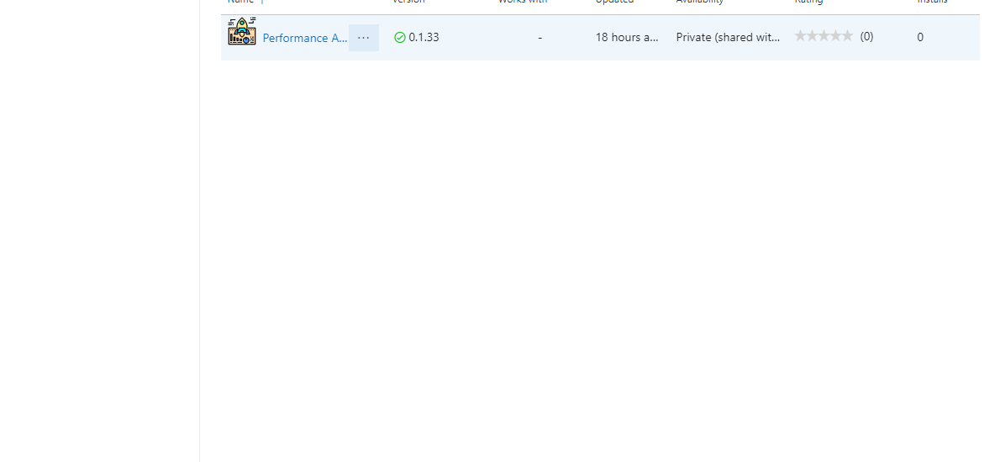
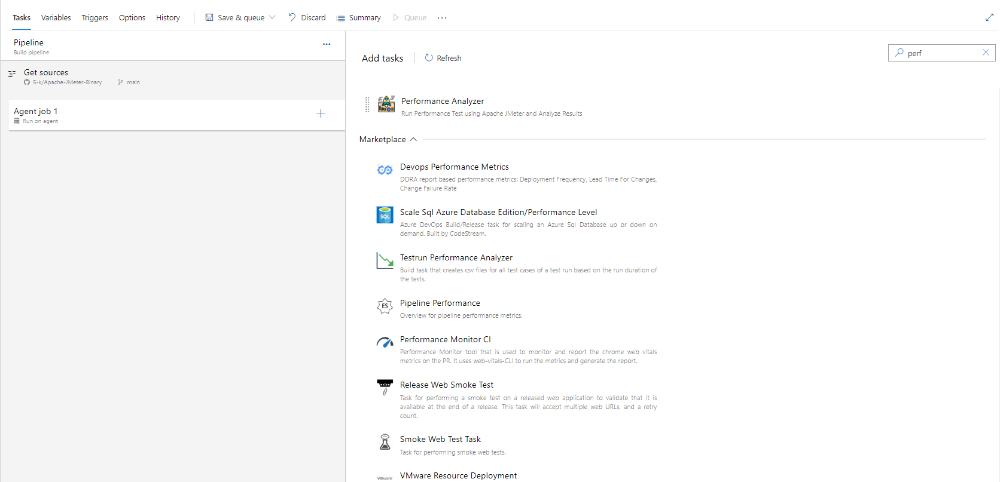
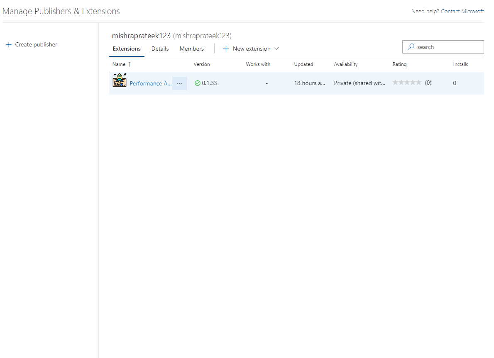
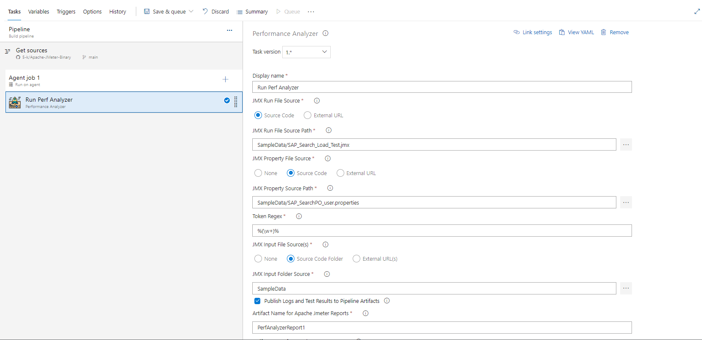
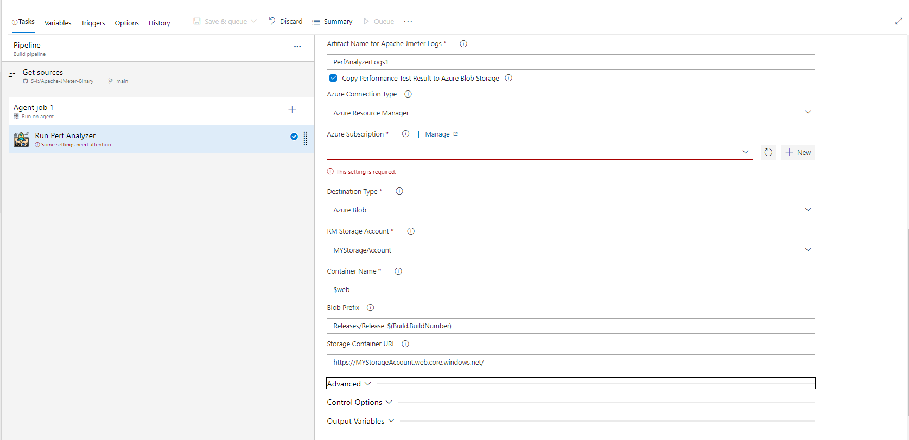
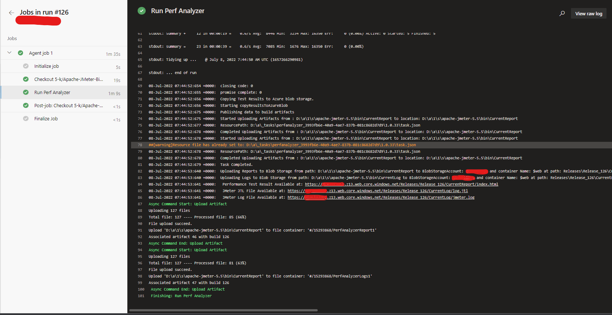
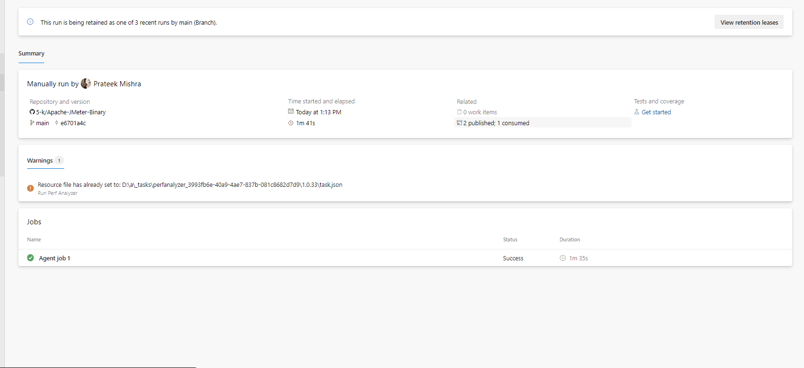
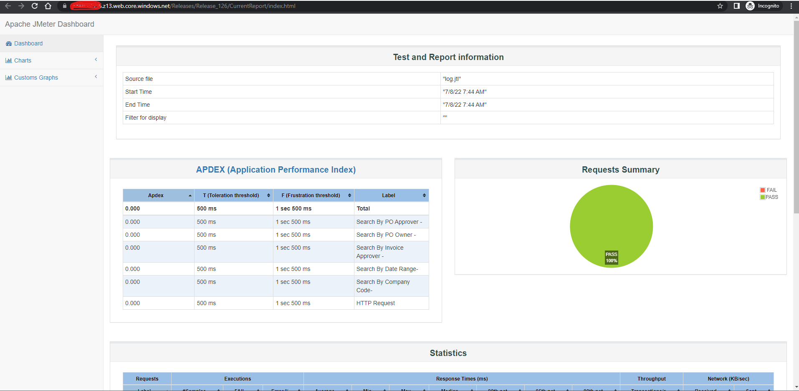

## About the Project
This is an Azure Devops Extension to Run Performance Test using Apache JMeter and Analyze Results.

This task enables to run Performance testng using Apache Jmeter, Analyze report and post results. 

This task uses Apache Jmeter 5.5 (can be modified) and expects a valid parametrized JMX File, Any input Files, and property file for JMX. The task runs the jmx files according to the configured values in JMX and uses property file and parametrizes it with the variables listed in pipeline variables. You can additionally use any number of user input files based on your test and mention them in property file for use. 

The pipeline task downloads your JMX, Propert File, Inpur files and then runs the JMeter task and publishes the result to build pipeline artifacts.

You can additionally host the data on a web url by using the Static Website hosting capacity of Azure storage account. The task publishes the results to your $web container of your storage container. 
You need to enable static hosting in the storage container in order to be able to view html results. These results are published and ready for view immediately after test result. The link of hosted website is available in the logs.

## Demo

## Features

- Run Apache JMeter Performance Tests
- Produces Results for Analysis by publishing it to artifacts for build pipeline.
- Uploads results to Azure Storage account using Static Store for viewing results through a online link.
- Cross platform - Can be integrated along with any project
- Can be used as a regression/integration test in build pipeline to ensure usecases pass per PR Request
- Can be used to tune and optimize performance based on the analysis.
- Can Fail task if the JMeter results any failure. This would help in continious integration test to idenitfy any breaking change. Integrating this in build pipeline would help idenify any breaking change before merge to main.

## Tech Stack

**Client:** Typescript, JavaScript

**Server:** Node, Azure ARM Template, Azure Storage

## Sample Usage

## Screenshots

## Installation To your Pipeline

1. Install the extension from Market Place

2. Search for the extension in your pipeline task

3. Add the task

4. Provide input to variables

5. Trigger the Pipeline

6. Verify Pipeline artifacts results and html report

## Pipeline Variables

The following variables are used in the pipeline. Some have default values which can be updated.

`JMX Run File Source` : This provides you the option to provide your JMX Source. It can be either from the source code of the pipeline or it can be a direct extenal URL. This is set to default to SourceCode

`JMX Run File Source Path`: This is the path of the JMX source code file. You can select the file path and update the input here. This is visible in case you select 'SourceCode' in the `JMX RUN File Source` step.

`JMX Run File Source URL` : This provides you the option to provide your JMX Source File via a direct extenal URL. A https url is expected here. This file will be downloaded from the link and used as JMX file source to run the test.

`JMX Property File Source` : This provides you the option to provide your JMeter Propery File Source. It can be none (in case your jmx does not require a property file to run), source code of the pipeline or it can be a direct extenal URL. This is set to default to SourceCode

`JMX Property Source Path`: This is the path of the JMeter Property source code file. You can select the file path and update the input here. This is visible in case you select 'SourceCode' in the `JMX Property File Source` step.

`JMX Source URL` : This provides you the option to provide your JMeter Property File via a direct extenal URL. A https url is expected here. This file will be downloaded from the link and used as JMX Property file source to run the test.

`Token Regex"` : This provides you the option to specify the regex for replacing the tokens in property File to the values specified in pipeline variables. This is visible only if the JMX Property File source is not set to None.This regex must include a group match. The regex match should be return a group of 2 values, one with variable name second with variable and enclosure. Samples (Starts and ends with 1 underscore ==>  _(\\w+)_ ,Starts and ends with % ==>  %(\\w+)%)

`JMX Input File Source(s)"` : This provides you the option to provide your JMeter Input File Source. Your test might require some test data stored in csv,xls etc. This tasks enables to procure those files and makes it available to test. It can be none (in case your jmx does not require any input file to run), source code of the pipeline or it can be a direct extenal URL. This is set to default to None. This option is visible only if `JMX Property File Source` is not set to None.

`JMX Input Folder Source`: This is the path of the JMeter Input source code Folder. All files inside this folder will be made available to JMeter test. You should the file names mentioned here in the property file and use that variable in JMX. You can select the folder path and update the input here. This is visible in case you select 'SourceCode' in the `JMX Input File Source(s) Source` step.

`JMX Input File(s) Source URL` : This provides you the option to provide your JMeter Input File(s) via a direct extenal URL(s). You can specify multiple urls comma seperated. All files mentioned will be downloaded sequentially and made available to Jmeter for test run. One or many, comma seperated, https urls are expected here.

`Publish Logs and Test Results to Pipeline Artifacts`: This is a boolean flag that if set to true will publish the test results and logs to pipeline artifacts. This should not be enabled if this task is used in a release pipeline. This is default set to true and will yield the result on task completion.

`Artifact Name for Apache Jmeter Reports`: This is the output artifact name for the test results. Only visible if the `Publish Logs and Test Results to Pipeline Artifacts` is set to true.

`Artifact Name for Apache Jmeter Logs`: This is the output artifact name for the test logs. Only visible if the `Publish Logs and Test Results to Pipeline Artifacts` is set to true.

`Copy Performance Test Result to Azure Blob Storage`: This is a boolean flag that if set to true nabling this would help to copy Apache Jmeter's Performance Test Report, Log File and JTL File to be copied to Azure Blob Storage. Using Static website hosting turned on you can access any run report later as well via a direct link."

`ConnectedServiceNameSelector`: This is a picklist option to specofy where to make azure connection. Currently this is set to Azure Resource Manager only.

`Azure Subscription`: This option lets you select the subscription in which you have created your storage container.

`Destination Type`: This is where your output result and logs would be copied to. Currently only Azure Blob Storage is supported.

`RM Storage Account`: This is the storage account name inside the above mentioned subscription. You need to `Enable Static Sorage Hosting` option here and create a container named $web inside. For this container $web, you will need to change the access to publish in order to view html reports. You can either do this or create a CDN to expose data from here More details availabe here: https://docs.microsoft.com/en-us/azure/storage/blobs/storage-blob-static-website.

`Container Name`: This is the container name inside the storage account where your results and logs will be copied. This is defaulted to $web. Note that in case you want continious reporting available on html webpage, keep it to $web only. Files in $web will be available to view as html files.

`Blob Prefix`: This is the prefix inside container name where each run's report will be copied. It is essential to note that for continious integration and testing it's best to prefix it will build number. This way all continious build's result will be made available at all times as a http exposed url.

`Storage Container URI`: This is the Primary endpoint URI for your container. On Enabling static web hosting, this url is made available. If not specified, the task will not be able to create a direct html link to the test results.

#### Advance Variables
These variables are available under the `advanced` section of the pipeline. These are default to some values and do not require change unless you want to customize it.

`JMeter Download URL`: This is the https link to Jmeter binary. A tgz binary file https url is expected here. It is set to download 5.5 version of apache Jmeter by default.

`JMeter Folder Name`: In case you modify the JMeter Download URL, to some other version then this variable also needs to change. This is the folder name of the Jmeter binary file post extraction/unzip.

`JMeter Log Folder Name`: This is the name of Log folder that is created as a result of test run. This is defaulted to CurrentLog. This is one of the artifacts that is later published as well.

`JMeter Report Folder Name"`: This is the name of Result folder that is created as a result of test run. This is defaulted to CurrentLog. This is one of the artifacts that is later published as well.

## Support

For support, email at prateek15mishra@gmail.com 

## License

## 🔗 Links

